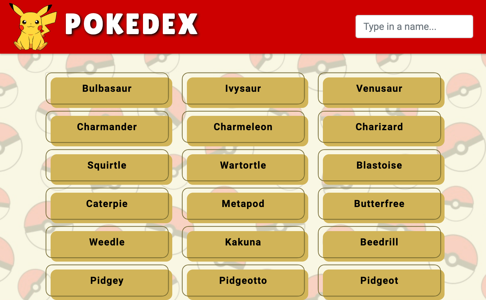

# Pokedex 
A simple Javascript app built with HTML, CSS, and Javascript. 
# Access
[Find the finished project here](https://imonagain.github.io/pokedexapp/)
# Goal
Build a small web application with HTML, CSS and Javascript as a part of Career Foundry's 
First Achievement Project
# Screenshot

# Features
- Loads data from external API
- View list of items
- On user action, view details for items

